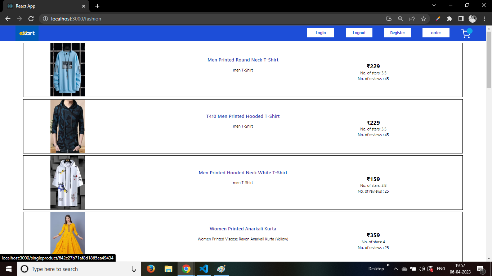
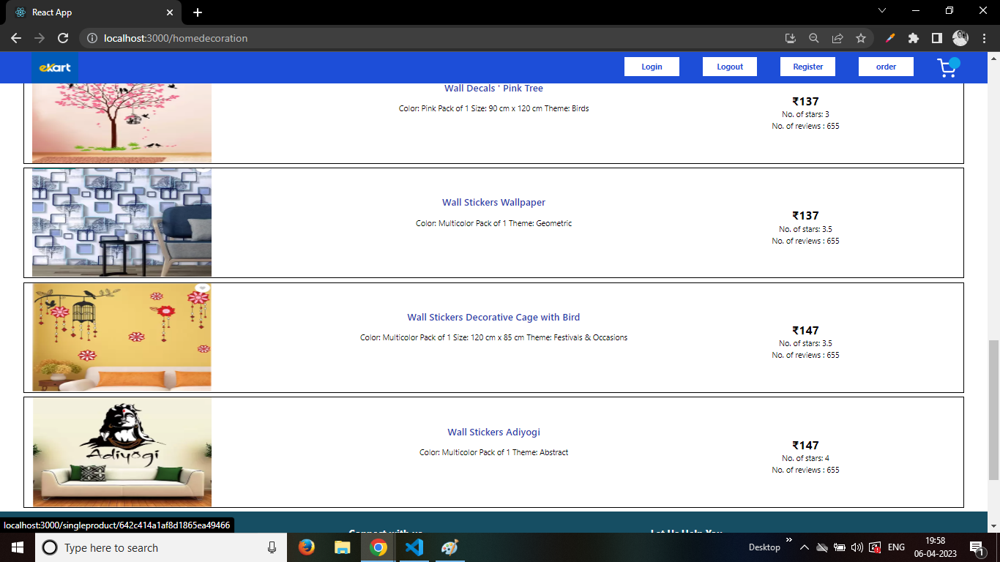
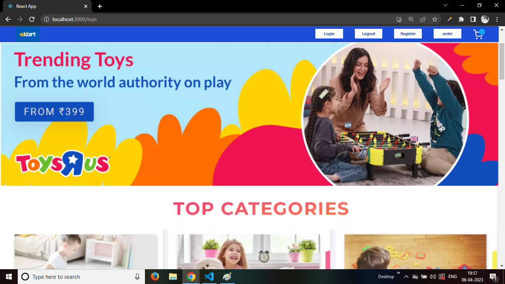
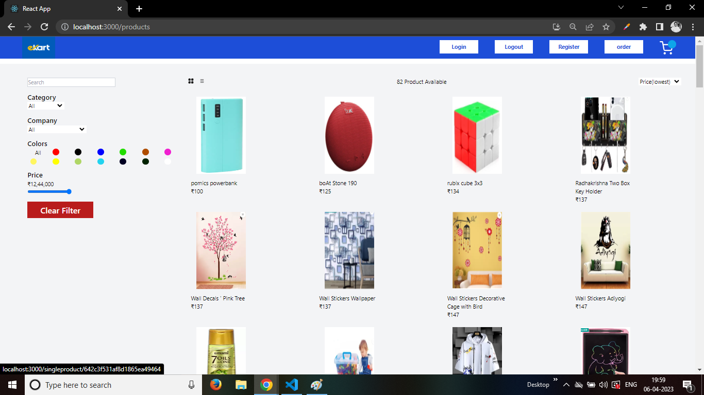
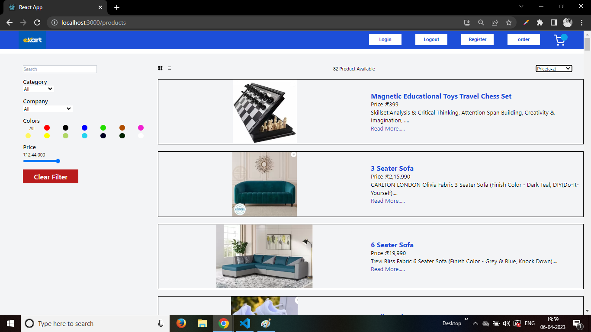
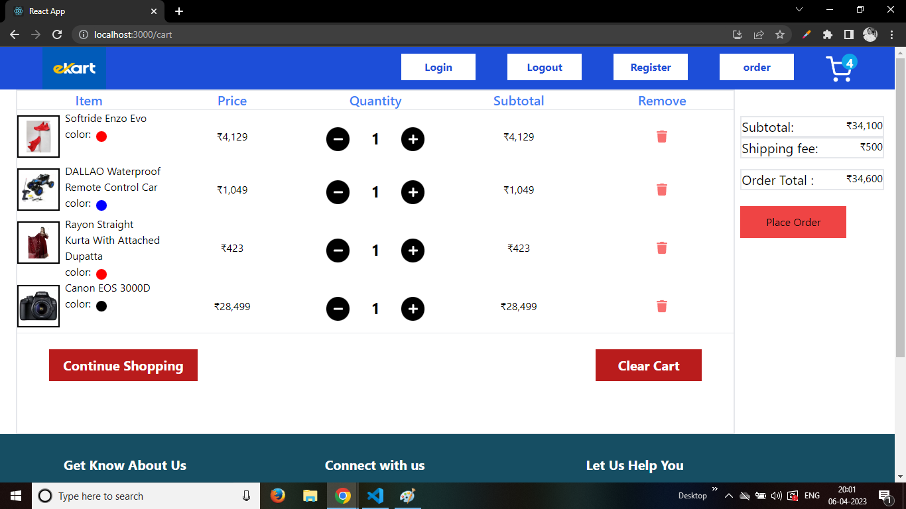
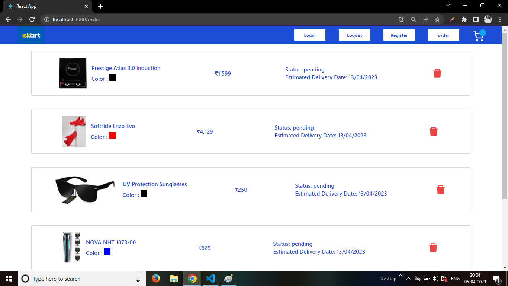

# E-Commerce Website
### This is an E-Commerce websitethat offers a wide variety of products for sale. We aim to provide our customers with a seamless shopping experience and high-quality products at competitive prices.

## Features
* Secure user authentication and authorization using JSON Web Tokens
* Persistent cart that is saved to local storage and database
* Search functionality to easily find products
* Product filtering by category and price range and color
* Direct buy products or after add products to cart then place order 
* verify user before show order and cart page
* detabase oparation perform instantly when add or delete cartitems or order items

## Technology Used 

## Installation
### To install on your local machine, follow these steps:

1. Clone the repository
2. Install the required dependencies using npm install
3. Start the server using npm start
4. Visit localhost:3000 on your web browser to access the website

## Contributing
### We welcome contributions from anyone who wants to help improve [Website Name]. If you would like to contribute, please follow these guidelines:

1. Fork the repository
2. Create a new branch for your changes
3. Make your changes and commit them with descriptive commit messages
4. Push your changes to your forked repository
5. Create a pull request to merge your changes into the main repository

